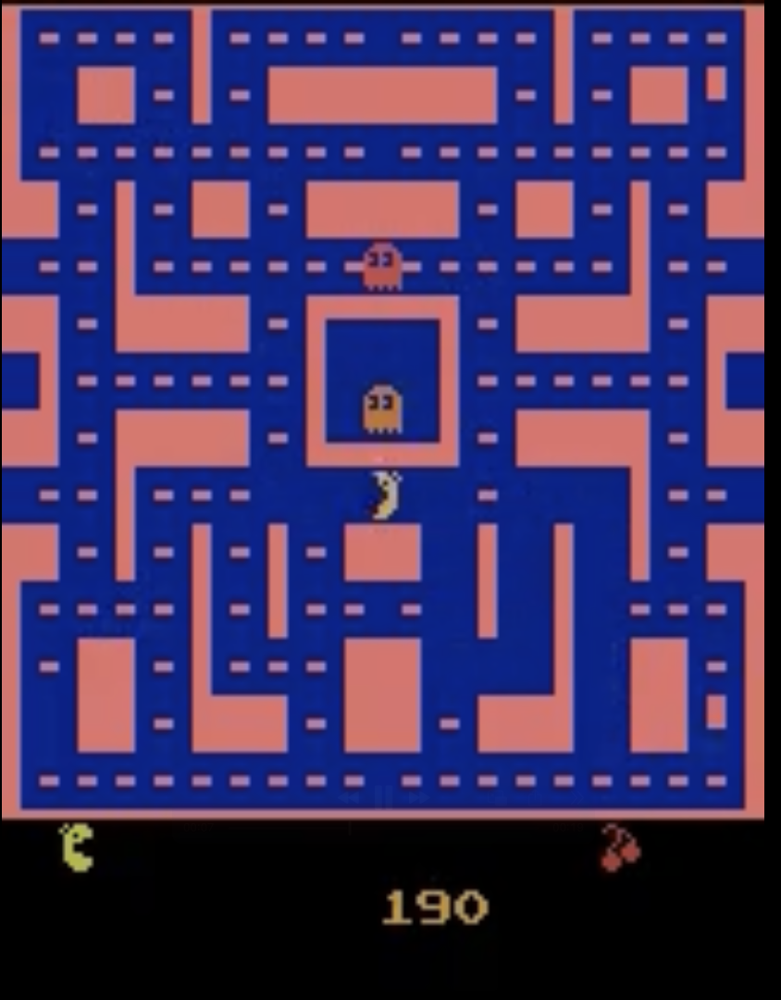

# Part 1: DQN Training for Ms. Pac-Man

## Overview

This project trains a Deep Q-Network (DQN) agent for the Atari game `ALE/MsPacman-v5`. It supports two main configurations for experience replay, allowing for a comparative analysis of their impact on learning and representation.

### 1. Epsilon-Greedy with Standard Experience Replay (Default)
- **Action selection:** Epsilon-greedy strategy, where the agent chooses a random action with probability ε (epsilon) and the best-known action otherwise.
- **Epsilon annealing:**
  - Initial epsilon: 1.0
  - Final epsilon: 0.1
  - Exponential decay over 1,000,000 steps.
- **Experience Replay:** A standard, uniform-sampling replay buffer is used.
- **Reward:** Only extrinsic (environment) reward is used.
- **Usage:**
  ```bash
  python train_dqn.py
  ```
- **Logging:** Training progress, including reward, epsilon, and loss, is logged to the console and Weights & Biases.

### 2. Epsilon-Greedy with Prioritized Experience Replay (PER)
- **Action selection:** Same epsilon-greedy strategy as the default mode.
- **Prioritized Experience Replay (PER):**
  - Enabled via the `--use_per` command-line flag.
  - Uses a sum-tree for efficient, priority-based sampling of transitions.
  - TD-error is used to prioritize "surprising" or more informative experiences.
  - Alpha (priority exponent) and beta (importance sampling correction) are used, with beta annealed from 0.4 to 1.0 over the course of training.
  - Importance sampling weights are applied to the loss to correct for the sampling bias.
- **Usage:**
  ```bash
  python train_dqn.py --use_per
  ```
- **Logging:** In addition to standard metrics, the current value of PER beta is logged.

## Command-Line Arguments
- `--use_per`: Enables Prioritized Experience Replay.
- Other arguments for controlling episodes, buffer size, and saving remain available.

## Implementation Details

### Environment Setup
1. Set up the Atari Ms. Pac-Man environment (`ALE/MsPacman-v5`) using Gymnasium.
2. The environment is wrapped and configured for:
   - Lower resolution (84x84 pixels) for efficiency.
   - Grayscale frames to reduce dimensionality.
   - 8-frame stacking to provide temporal information to the agent.
   - Standard Gymnasium `terminated` and `truncated` signals for end-of-episode detection.

### Agent Training
1. A DQN (Deep Q-Network) agent is implemented in PyTorch.
   - **Architecture**: A CNN with 3 convolutional layers followed by 2 fully connected layers.
   - **Input**: State is represented by 8 stacked frames (as in the original for Breakout).
   - **Experience Replay**: A buffer with a capacity of 1,000,000 transitions. Supports both standard and prioritized replay.
   - **Target Network**: Updated every 10,000 training steps.
   - **Exploration**: Epsilon-greedy with exponential decay.
   - **Optimizer**: Adam with a learning rate of 2.5e-4.
   - **Batch Size**: 32.
   - **Double DQN**: Implemented to reduce Q-value overestimation.
   - **Loss Function**: Huber Loss for more robust learning.
   - **Gradient Clipping**: Gradients are clipped to a norm of 1.0 for training stability.
   - **Device Support**: Proper device selection (CUDA/MPS/CPU) and `torch.compile` for potential speed-ups.

### Data Collection
- For each training run, the following are saved:
  - **Model Checkpoints**: The state dictionary of the agent's policy network is saved periodically and at the end of training as `.pth` files. The filenames indicate the configuration used (e.g., `_PER` or `_NoPER`).
  - **Gameplay Data (Optional)**: If not disabled with `--no_save`, the agent saves game frames and corresponding actions to disk, allowing for later analysis or video generation.

### Tools and Libraries
- PyTorch for agent implementation.
- Gymnasium for the Atari environment.
- Weights & Biases for experiment tracking and logging.
- NumPy and TQDM for data handling and progress bars.

### Success Criteria
- The primary goal was not to achieve a state-of-the-art score, but to train competent agents under different conditions (PER vs. No-PER) to enable a meaningful analysis of their learned internal representations.
- The key success criterion was the generation of distinct, well-trained models whose latent spaces could be visualized and compared to draw insights about how different training dynamics affect an agent's perception of the game state.

## Progress and Improvements Status

This section outlines the implementation status based on the original project plan.

1.  ✅ **Visualize Agent Gameplay & Representations**
    - Latent space visualizations are a core component of this project, implemented in `visualize_latent_space.py`.
    - While direct video recording was not implemented in the training script, the saved frames can be used to generate videos offline.

2.  ❌ **Upgrade Environment to Full RGB and Higher Resolution**
    - **Status: Not Implemented.**
    - The project deliberately used standard 84x84 grayscale frames, which are common in RL research and sufficient for the comparative analysis performed.

3.  ✅ **Implement Prioritized Experience Replay**
    - **Status: Implemented.**
    - PER is fully implemented and can be enabled with the `--use_per` flag. This was crucial for comparing against the standard replay mechanism.

4.  ❌ **Implement Reward Shaping**
    - **Status: Not Implemented.**
    - The project uses the raw, extrinsic rewards from the environment to keep the learning signal pure and focused on the game's objective.

## Environment Setup & Troubleshooting

- After installing dependencies from `requirements.txt`, you may need to install the Atari ROMs:
  ```bash
  python -m gymnasium.utils.roms --accept-license
  ```
- This command will download and install all required Atari ROMs. If you encounter errors about missing ROMs, running this command should resolve them. 

## Experimentation Notes and timeline:

- `torch.compile()` may be disabled at places due to it not working properly on `mps` at times. So please re-enable at your expense.

- The experimentation began with choosing the DQN Architecture as well as analyzing which configurations of the models will probably work better for the game I was implementing it for : MsPacMan.

- At first, I trained the standard DQNAgent from the Breakout experiments on `2000` episodes data, due to constraint on compute, the goal was to get an expressive agent which is able to perform well in a reduced experimentation space. The breakout experimentations revealed the stark differences in both the approaces both **PER** and **non-PER**.

- Further I initialized the Atari Environment and the DQNAgent for Ms.PacMan and set them each to train for the `2000` episodes and analyze which one performs better and ultimately chose the PER based agent for the following reasons : 

  - **Rewards :** PER peaks at around `700` for this setting whereas non-PER plateaus around `500`.

  - **Value Function Learning :**  PER finishes with a Mean Q-Value of around `400`, Q-value variance is around `200`, and has a max peak of Q-value reaching about `1200`. Non-PER on the other hand finishes with a mean Q-value of around `50`, very low Q-value variance of about `25` and maximum Q-value was only around `200-300`. 

  - **Gradients :** Both the variants displayed stable relatively stable gradients throughout the training process.

  - **TD-Error and Policy development :** While training I noticed that PER showed higher TD errors, about in the range of `~50-60`, in contrast to the Non-PER version which showed just `5` with early plateuing. I considered it as a sign that the Non-Per version is not able to find and prioritize the important experiences.

  - **Overall Performance :** Overall the PER variant showed a better active learning till the end of learning as evidenced by the TD error as well as it seems to continue improving the performance while the non-PER version just plateaus a bunch of times.

  - **Interesting finding :** It looked as though the PER agent was able to start actually stabilizing rewards and go towards active learning closer to the end of the training run, but due to not being able to fit my compute budget the training had to be stopped and ultimately PER version had to be chosen. 

- Based on the fact that I was on a budget in terms of compute, I preferred to choose the PER version to increase the chances of being able to generate a dataset with variety of gameplays for better learning for the VQVAE and then increased the number of episodes to `5000` and finally went towards video generation through the already present `record_videos.py` file.

- Because the Non-PER agent seemed to have plateaued a bunch of times it seemed as if generating the video data will lack the diversity required by the VQVAE to generate frames or imagine the scenarios, it could also happen that I would just get stuck with a single frame being generated a bunch of times. Also in a game like Ms.PacMan where there are several dynamics to understand from the screen, like the placement of te ghosts, the whole landscape of the level, it definitely meant that I had to use data with better diversity than I was promised with the Non-PER agent.

- Thus I moved ahead by sticking with the PER version, training it further on a `5000` more episodes and then generated the video data and the frames using the `record_videos.py` file.

- All the training runs were logged through WandB, links for all of them as below : 
  - **Original Breakout DQNAgent training to understand the dynamics of the Atari Environment as well as the performance of the agents :** [WandB Link](https://wandb.ai/retr0sushi-04/atari-dqn?nw=nwuserretr0sushi04)

  - **PER and Non-PER DQNAgents for Ms.PacMan project :** [WandB Link](https://wandb.ai/retr0sushi-04/atari-drl-experiments/workspace?nw=nwuserretr0sushi04)

## My learnings, observations, final takes and improvements regarding this phase 1 of Ms.PacMan :

  - During the final stages of the training run the PER version of the agent had seemed to become finally active in the learning phase almost achieving equal average rewards during the latter stages as compared to the PER variant, but sadly due to compute requirements I had to stop the training there, it could be due to the fact that finally the Non-PER variant was able to grasp the complex dynamics of decision making in the Ms.PacMan games where there are tons of things to consider for a single situation on top of the `9` possible movements. It would be interesting to see how it will improved if I had trained it on a whole bunch of data, it could possible show better signs of decision making in the long run.

  - My comparison between PER and Non-PER appraoches is currently based on a single set of data which was generated, however it would have proved to be an interesting experiment to have trained these agents on 2-3 different seeds, to try and certainly visualize which option is actually beneficial for data generation. It would also reflect more robust agents if I trained on that data. However currently, this experiment could prove to be a baseline as well as a lesson in training agents for the future which I would definitely like to revisit and experiment more on.

  - My assumption that the PER agent will certainly generate more VQVAE data seems a bit naive, while it seemed to me like I was right to make this decision in the current scenario, what I would have done differently is : 

    - Add more metrics to determine the `quality of the generated data`, or `ghost varieties` etc.

    - It would also prove to be very interesting to form a metric and actually compare Non-PER and PER generated datasets for these metrics. After all, the quality of the data is essential.
  
  - Not using a DuelingDQN : 
    
    - I preferred not to use a Dueling DQN simply because of the fact that it kept overfitting at times, also because each Dueling DQN run was taking about as much as `~3-4.5 hours` to train as compared to each standard DQN training run which each took about `~1.5-2.0 hours` all on a Colab T4.
  
    - I wasted a lot of time in these experiments a total of `12 hours` in training,  for finding an optimal DQNAgent.

  - Before this project, I had not done any practical deep RL experiments, only theoretical works such as learning about Bellman Equations for Q value estimation, Deep Q Nets, Values, Policies etc. This phase of the project really made me work on those skills finally and I was able to learn a lot about Deep RL and as well as the Atari simulation environment, it has been fruitful for even my growth.

  - A video of the agent playing the game : 
    - [](https://drive.google.com/file/d/1v3zSS4J9-GTF5NI9Vzb9G68OcERwJ6h2/view?usp=sharing)