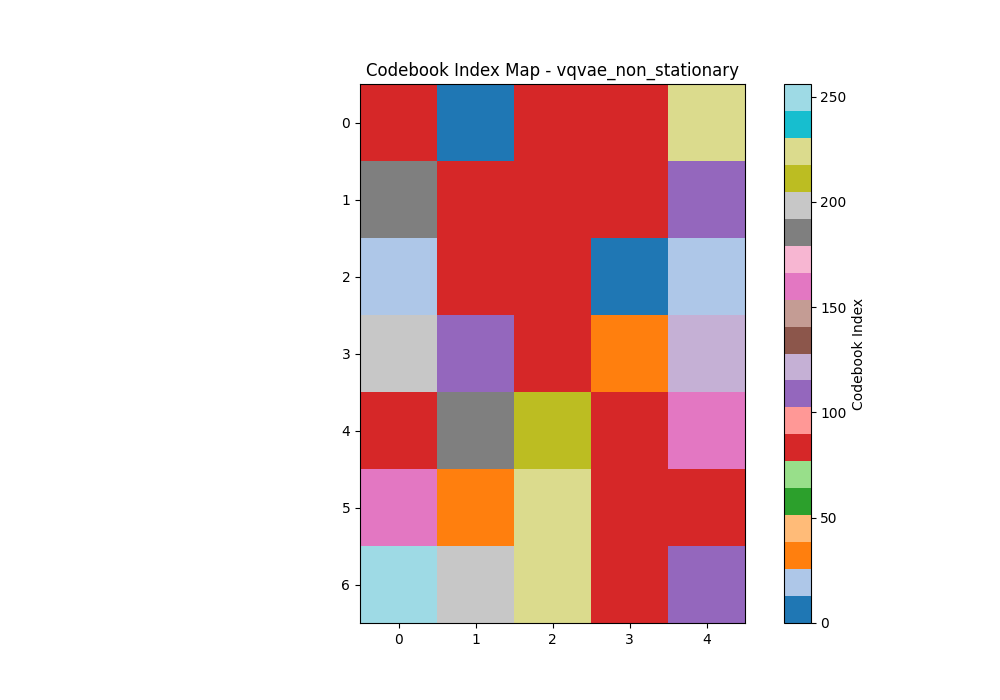

# Part 2: Latent Action Prediction Model for Ms. Pac-Man

## Overview
This part focuses on building a model to infer latent actions between consecutive frames for the game `Ms. Pac-Man`. Inspired by the LAPA paper, we use a Vector-Quantized Variational Autoencoder (VQ-VAE) to learn a discrete codebook of latent actions that represent the transitions between frames. The goal is to create a compressed, learned representation of game dynamics. 

## Main focus:
- My main focus through these series of experiments was to try out different approaches for training the VQVAE :
    - Use the current VQVAE for training on frame pairs.
    - Use a VQVAE with FiLM layer for training.
    - Use sequential latent reduction and evaluating how the model is progressing.
    
- Reducing the latent :
    - I reduced the embedding dimensions progressively for training the VQVAE. These models were not trained for long but to check how the training is progressing with continuously reducing the latent, and there are several reasons due to which I interrupted the training of the models which I will explain here through this particular report.
    - Through these experiments I learned some few interesting things about the reconstructions of the VQVAE, why did it lack where it lacked and how I tried to overcome it.

## Implementation Details

### Data Preparation
1.  Load consecutive frame pairs (`frame_t`, `frame_t+1`) from the gameplay recordings generated in Part 1.
    -   The dataset consists of episodes from the PER-trained DQN agent, stored as sequentially numbered PNG files.
    -   Frame resolution: 210 × 160 pixels, RGB format (3 channels).
2.  Create a PyTorch `Dataset` and `DataLoader` for efficient batching.
    -   The dataset is carefully constructed to respect episode boundaries, ensuring that pairs are only created within a single episode.
    -   Data is split into training (90%) and validation (10%) sets at the episode level to prevent data leakage.
3.  Apply preprocessing transformations:
    -   Convert images to PyTorch tensors.
    -   Normalize pixel values to the range `[-1, 1]` to align with the model's `tanh` activation in the final layer.

### Latent Action Model Architecture

The development of the model involved significant experimentation to find an architecture that was both expressive and computationally feasible.

**Architectural Journey:**

-   **Initial Complex Models (Embedding Dim 512 -> 256):** We began with complex architectures featuring high-dimensional embeddings (512, then 256). These models incorporated **FiLM (Feature-wise Linear Modulation)** layers to condition the decoder on the quantized latent representation. While powerful, these models were computationally expensive and prone to overfitting on the available data. 

-   **Final Architecture (Embedding Dim 64):** Through iterative experimentation, we discovered that a simpler architecture yielded a better balance of reconstruction quality and training stability. The final model removes FiLM conditioning in favor of a more direct approach and uses a smaller embedding dimension.

**Final Implemented Architecture:**
1.  **Encoder:**
    -   **Input:** Concatenated current and next frames (`frame_t`, `frame_t+1`) along the channel dimension (total 6 input channels).
    -   A series of 5 convolutional layers with stride 2 for downsampling, interspersed with `BatchNorm2d` and `ReLU` activations.
    -   The final layer projects the feature map to the target embedding dimension.
2.  **Vector Quantization (VQ) Layer:**
    -   **Codebook Size:** 256 vectors, allowing for an 8-bit representation of the latent action.
    -   **Embedding Dimension:** 64.
    -   Uses a straight-through estimator for backpropagation.
    -   A commitment loss (weight `0.25`) is used to encourage the encoder's output to stay close to the chosen codebook vectors.
3.  **Decoder:**
    -   **Input:** The quantized latent representation from the VQ layer.
    -   A series of 5 transposed convolutional layers for upsampling, mirroring the encoder's structure.
    -   The final layer uses a `tanh` activation to produce the reconstructed next frame, normalized to `[-1, 1]`.
    -   Crucially, **no skip connections** are used between the encoder and decoder. This forces all information about the transition to flow through the quantized latent bottleneck, ensuring the model truly learns to represent the action (similarly to the currently available VQVAE).

### Training Process
1.  **Optimizer:** Adam with a learning rate of `3e-4`.
2.  **Loss Function:**
    -   **Reconstruction Loss:** Mean Squared Error (MSE) between the predicted `frame_t+1` and the ground truth.
    -   **VQ Loss:** The sum of the codebook loss and the commitment loss from the quantization layer.
3.  **Logging and Monitoring:**
    -   Training is logged using **Weights & Biases**.
    -   Key metrics are tracked: training/validation losses, reconstruction quality (PSNR, SSIM), and codebook usage statistics (perplexity).
    -   Model checkpoints are saved periodically, with the best-performing model (based on validation loss) stored for later use.

### Latent Action Extraction
-   A function is implemented to take any pair of consecutive frames, pass them through the trained VQ-VAE's encoder and quantizer, and return the resulting grid of discrete latent action indices.
-   This function allows the entire gameplay dataset to be converted into a new dataset of `(frame_t, latent_action_indices, next_frame)`, which can be used for subsequent modeling tasks.

### Evaluation
1.  **Quantitative Metrics:**
    -   PSNR (Peak Signal-to-Noise Ratio) and SSIM (Structural Similarity Index) are used to measure reconstruction quality.
2.  **Qualitative Evaluation:**
    -   Visual inspection of reconstructed frames compared to the originals provides an intuitive sense of model performance.
    -   Heatmaps of the difference between actual and predicted frames highlight areas where the model struggles.
3.  **Codebook Analysis:**
    -   A histogram of codebook usage and the perplexity metric are monitored to ensure the model is utilizing a diverse range of latent codes.

### Success Criteria
-   Achieve a validation PSNR > 25 dB, indicating high-quality reconstructions.
-   Ensure that a significant portion of the codebook is actively used (perplexity > 50% of codebook size).
-   Produce visually plausible next-frame reconstructions that accurately capture game dynamics like character and ghost movements.

## Experiment Results and Analysis

This section details the findings from the various architectural experiments performed on the VQ-VAE model.

### Experiment 1: Baseline VQ-VAE (Embedding Dim: 128)
The initial baseline model with a 128-dimensional embedding served as a starting point.
- **Performance:** It achieved reasonable reconstruction quality on static background elements. However, it struggled significantly with dynamic objects, particularly Ms. Pac-Man and the ghosts. Reconstructions often showed them as blurry artifacts or failed to capture their movement accurately between frames.
- **Training times:** `Epochs : ~10 epochs`, `Time : 1.5 hours`, stopped due to very poor perplexity scores.
- **Perplexity Issues:** The model suffered from extremely poor codebook utilization. Perplexity scores remained consistently low (< 20), indicating that only a small fraction of the 256 available codebook entries were being used. This showed that the model was collapsing to a few dominant codes and failing to learn a diverse representation of dynamics of the game.
- **Observation:** This suggested that a simple MSE loss on the entire frame was not sufficient to force the model to prioritize these small but crucial game elements, and the codebook was severely underutilized.

### Experiment 2: VQ-VAE with FiLM Conditioning
To improve the decoder's ability to use the latent information, a model with FiLM layers was tested.
- **Performance:** While theoretically more powerful, the FiLM-based model was computationally very expensive. More importantly, it showed clear signs of overfitting. The validation loss did not improve consistently and the reconstructions, while sometimes sharp, often contained bizarre artifacts. The model seemed to be memorizing transitions rather than learning a general representation of game dynamics.
- **Training time:** `Epochs : ~30 epochs`, `Time : ~2 hours`, stopped due to very poor perplexity scores.
- **Perplexity Issues:** Similar to the baseline, this model also exhibited terrible codebook utilization with perplexity scores hovering around 15-25. The additional complexity from FiLM layers did not help with the fundamental problem of codebook collapse. In fact, the overfitting made the perplexity problem worse as the model became even more selective about which codes to use.
- **Conclusion:** This approach was abandoned due to its high computational cost, poor generalization, and severe codebook underutilization.

### Experiment 3: Progressive Latent Space Reduction (512 -> 256 -> 64)
The final set of experiments focused on simplifying the model and finding the "sweet spot" for the embedding dimension.
- **Embedding Dim 512/256:** These larger embedding spaces led to models that were slow to train and, similar to the FiLM model, had a tendency to overfit. The perplexity of the codebook usage was also lower than desired, hinting that the model was not utilizing the large codebook effectively.
- **Perplexity Crisis:** Both the 512 and 256 dimensional models showed consistently poor perplexity scores (typically 10-30), meaning that out of 256 possible codebook entries, only a handful were being actively used. This helped me realise a fundamental failure of the vector quantization mechanism.
- **Embedding Dim 64:** Reducing the embedding dimension to 64 provided the best trade-off.
    - **Improved Generalization:** Overfitting was significantly reduced and it seemed that the smaller bottleneck forced the model to learn a more efficient and generalizable representation of the frame-to-frame transitions. So at least something good came out of reducing the embedding dimesionsm which I was about to give up on.
    - **Better Dynamics:** While still imperfect, this model was noticeably better at reconstructing the movement of Ms. Pac-Man and the ghosts compared to the baseline. The reconstructions were more consistent and less blurry, and so I let it train for about `7 hours`.
    - **Computational Efficiency:** The model was significantly faster to train, allowing for more iterative experiments.
    - **Perplexity Improvement:** Most importantly, this configuration finally achieved reasonable perplexity scores (60-80), indicating that a significant portion of the codebook was being utilized. This was a crucial breakthrough that validated the model was learning a diverse set of latent representations.
    - **But:** I trained this model for `200 epochs` roughly `~450K iterations` with a dataset of `300 episodes` and `1500 frames` per episode. At the time of training it seemed like that it was going pretty well, but at around the 7 hour mark it seemed that the model had finally reached it's limit and the perplexity had just about plateaued at `55-60`, which was still a commendable feat after my 2 failed experiments. And thus I decided to go ahead with this for the time being. 

### Visual Evidence of Training Progress
The progression from poor to improved reconstructions can be observed in these training snapshots from the final 64-dimensional model:

- **Early Training (Step 30,791):** Initial reconstruction attempts showing the model beginning to learn basic structure:
  - 
  
- **Mid Training (Step 41,326):** Improved reconstruction quality as the model learns better representations:
  - 
  
- **Late Training (Step 44,386):** Final reconstruction quality showing the model's ability to capture game dynamics:
  - 

### Comprehensive Latent Space Analysis

**Final Model Reconstructions on Test Scenarios:**
- **Stationary Frame Analysis:** Testing reconstruction quality on frames with minimal movement:
  - 

- **Dynamic Frame Analysis:** Testing reconstruction quality on frames with significant movement:
  - 

**Latent Space Activation Patterns:**
- **Stationary Frame Latent Activations:** Heatmap showing which latent codes are activated for static scenes:
  - 

- **Dynamic Frame Latent Activations:** Heatmap showing latent activation patterns during high-movement scenarios:
  - 

**Codebook Utilization Analysis:**
- **Stationary Frame Codebook Usage:** Distribution of codebook entries used for static game states:
  - 
  - 

- **Dynamic Frame Codebook Usage:** Distribution of codebook entries used for dynamic game states:
  - 
  - 

### Final Takeaways
The iterative process of simplifying the model architecture and reducing the latent space dimensionality was key to achieving a better result. **The perplexity scores served as a critical diagnostic tool** - consistently poor perplexity indicated fundamental problems with the vector quantization mechanism that made the models effectively useless regardless of reconstruction quality. The final VQ-VAE with a 64-dimensional embedding proved to be the most effective, providing a good balance between reconstruction quality, generalization, computational efficiency, and most crucially, better codebook utilization as evidenced by the significantly perplexity scores. It seemed that the latent space could be compressed in this manner and still be utilized for the reconstructions.

## Experimentation Notes and Timeline:

- The VQ-VAE experimentation was probably the most challenging part of this entire project, not just technically but also in terms of understanding what was actually going wrong when models weren't working.

- I started this phase right after getting decent PER agent data from Part 1, thinking that the VQ-VAE would be straightforward since I had the frame pairs ready. I was completely wrong about this assumption.

- **Initial Approach (Embedding Dim 128):** I began with what seemed like a reasonable embedding dimension based on literature. The training seemed to progress normally - loss was decreasing, reconstructions looked "okay" at first glance. But when I actually looked at the perplexity scores, they were absolutely terrible (< 20). This was my first real lesson that **you can't just look at reconstruction loss** - the codebook utilization is equally, if not more, important.

- **FiLM Experiment:** Frustrated with the poor dynamics reconstruction, I thought the issue was that the decoder wasn't properly using the latent information. So I implemented FiLM layers thinking this would help condition the decoder better. This took me about `4-5 hours` to implement properly, and then another `2 hours` of training time, only to discover that it made everything worse. The model was overfitting badly and the perplexity was even more terrible (15-25). This taught me that **more complexity doesn't always solve fundamental problems**.

- **Progressive Reduction (512 -> 256 -> 64):** After the FiLM experiment, I decided to go in the opposite direction and simplify. I tried progressively smaller embedding dimensions. The 512 and 256 models were painfully slow to train on my setup, and the perplexity remained awful (10-30). It was only when I got to 64 dimensions that things finally clicked.

- **The Breakthrough:** When the 64-dimensional model finally achieved perplexity scores of 60-80, it felt like a huge victory. Not just because the numbers were better, but because I could finally see in the reconstructions that the model was learning to represent different types of movements and game states.

- All VQ-VAE training runs were logged through WandB for tracking metrics and visualizations: 
    - [Final VQ-VAE Experiments WandB Link](https://wandb.ai/retr0sushi-04/ms-pac-man-vqvae/runs/6owfnbvi?nw=nwuserretr0sushi04)
    - [Failed VQ-VAE Experiments WandB Link](https://wandb.ai/retr0sushi-04/atari-vqvae?nw=nwuserretr0sushi04)

## My Learnings, Observations, Final Takes and Improvements Regarding This Phase 2 of Ms.PacMan:

- I initially focused way too much on reconstruction quality and ignored perplexity. But a model with great PSNR and terrible perplexity is essentially useless because it's not learning a diverse latent representation. This completely changed how I evaluate generative models now.

- The FiLM experiment was a perfect example of how I was overcomplicating things. The 64-dimensional simple architecture outperformed all the complex, high-dimensional variants. The solution ended up being a simpler architecture instead of a complicated one.

- I learned that you can't trust your eyes alone when evaluating VQ-VAE reconstructions. A reconstruction might look "reasonable" but if the perplexity is low, the model is basically memorizing a few transitions rather than learning generalizable dynamics. The metrics told the real story.

- It took a total of `14+ hours` of building, debugging and training time for me to achieve this, I should be more smarter about my compute as well as which part I am giving the time to.

- **What I Would Do Differently:**
  - **Start with perplexity tracking from day one** instead of focusing only on reconstruction loss.
  - **Run multiple seeds** for each architecture to ensure results are robust.
  - **Implement perceptual loss earlier** - I think this could have helped with the dynamic object reconstruction issues.
  - **Use smaller validation batches** for quicker iteration during the experimentation phase.

- Before this project, I had only worked with standard autoencoders. Learning about vector quantization, commitment loss, and the intricacies of discrete latent spaces was completely new territory. The debugging skills I developed here have been invaluable for subsequent projects.

- **Future Improvements:** 
  - The final model still struggles a bit with fine-grained ghost movements. I think a hybrid loss combining MSE and perceptual loss could help.
  - Implementing exponential moving averages for the codebook could improve stability.
  - A larger codebook (512 instead of 256) might be beneficial now that I know how to achieve good perplexity.